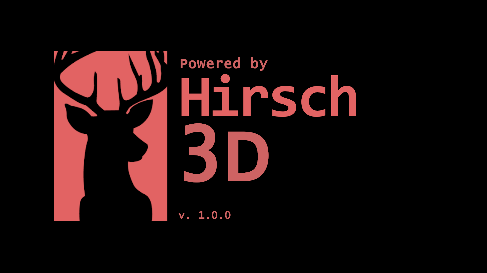
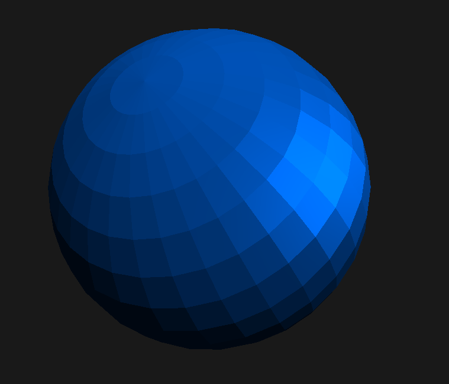

# Hirsch 3D Renderengine Version *0.8.6*
[](https://github.com/hackfleisch1337/Hirsch3D_Release_v1.0/tags)
[](https://github.com/hackfleisch1337/Hirsch3D_Release_v1.0/issues)
[](https://github.com/hackfleisch1337/Hirsch3D_Release_v1.0/graphs/contributors)
---


---
## About
The Hirsch 3D Renderengine is a Gameengine Library for C++.
It supports rendering OBJ files with textures, materials and normalmaps.

## License
---
## MIT Licence *(Modified)*

**Copyright (C) 2021 Emanuel Zache**

Permission is hereby granted, free of charge, to any person obtaining a copy of this software and associated documentation
files (the "Software"), to deal in the Software without restriction, including without limitation the 
rights to use, copy, modify, merge, publish, distribute, sublicense, and/or sell copies of the Software, and to permit 
persons to whom the Software is furnished to do so, subject to the following conditions:

*The above copyright notice and this permission notice shall be included in 
all copies or substantial portions of the Software.*

**THE SOFTWARE IS PROVIDED "AS IS", WITHOUT WARRANTY OF ANY KIND, EXPRESS OR IMPLIED,
INCLUDING BUT NOT LIMITED TO THE WARRANTIES OF MERCHANTABILITY, FITNESS FOR A PARTICULAR PURPOSE AND NONINFRINGEMENT.
IN NO EVENT SHALL THE AUTHORS OR COPYRIGHT HOLDERS BE LIABLE FOR ANY CLAIM, DAMAGES OR OTHER LIABILITY, WHETHER IN AN ACTION OF CONTRACT, TORT
OR OTHERWISE, ARISING FROM, OUT OF OR IN CONNECTION WITH THE SOFTWARE OR THE USE OR OTHER DEALINGS IN THE SOFTWARE.**

Use the same license on any Hirsch3D Project.

Extract from the license of glm:
> Restrictions:
> By making use of the Software for military purposes, you choose to make a
> Bunny unhappy.

Credits for used libraries can be seen in the ```README.md``` file

*See* ```LICENSE.md```
---
## Hirsch3D Uses
* **SDL** by *(C) 1997-2020 Sam Lantinga*
* **Glew** (for OpenGL) by *Copyright (C) 2002-2007, Milan Ikits,
                Marcelo E. Magallon,
                Lev Povalahev*
* **stb image** by *(C) 2017 Sean Barrett*
* **stb truetype** by *(C) 2017 Sean Barrett*
* **glm** by *(C) 2005 - G-Truc Creation*
* **OBJ_Loader** by *(C) 2016 Robert Smith* 

## How to use Hirsch3D
This following code is a sample code to show the basic usage of Hirsch3D

> *Main.cpp*
```C++
#include <Hirsch3D/Hirsch3D.hpp>

class Game: public h3d::Hirsch3D {
private:

    h3d::Object sphere; // The sphere object
    h3d::Scene scene; // The scene
    h3d::Camera camera; // The camera

    void setup() override {
        sphere.loadByPath("sphere.obj",h3d::color::cobalt_blue, nullptr); // nullptr = no texture
        camera.init(100, 1920, 1080); // FOV, width, height
        camera.translate({0,0,3}); // Move camera backward
        camera.update();
        scene.load(&camera); // Loads the scene

        scene.addObject(&sphere); // Adds the sphere to the scene

    }

    void render(const h3d::Renderer &r) override {
        scene.render(r); // renders the scene
    }

    void onClose() override {

    }

};

int main(int argc, char** argv) {

    Game game; // Create the game object
    game.init("Window title", 1920, 1080, HIRSCH3D_NOFLAG);
    game.setFps(120);
    game.load(); // Loads the game
    game.start(); // starts the game loop

    return 0;
}
```
<br>This code will display a blue sphere: <br>


## How to compile (MinGW GCC)
---
Run this command on the Windows Terminal. Make sure that you have MinGW installed on your computer and added it to *PATH*. <br>
The `-I` and `-L` option require the path to the `include` and the `lib` folder. The command below contains the path <br>
when the downloaded folder is in the directory when the command is executed. So make sure the boath paths are correct.
```bat
g++ Main.cpp -IHirsch3D_Release_v1.0/include -LHirsch3D_Release_v1.0/lib -lglew32 -lSDL2main -lopengl32 -lHirsch3D -oProgramm.exe
```
Execute:
```
./Programm.exe
```
**Make sure** that the ```shader``` folder all files from the ```bin``` folder are copied in the same directory than the **.exe** file.<br>
The folder should look like this:
> Main.cpp <br>
> SDL2.dll <br>
> glew32.dll<br>
> Hirsch3D.lib<br>
> Programm.exe<br>
> shpere.obj<br>
> **shader/**
>> 2d.frag<br>
>> 2d.vert<br>
>> font.frag<br>
>> font.vert<br>
>> Hirsch3D.png<br>
>> shader.frag<br>
>> shader.vert<br>
>> **main/**
>>> shader.frag<br>
>>> shader.vert
